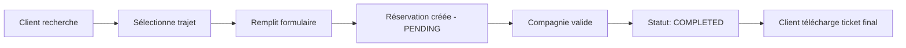
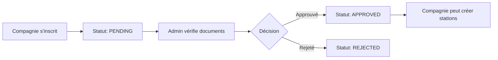

# 🚌 VoyageBj - Plateforme de Réservation de Transport au Bénin

<div align="center">


**Plateforme moderne de gestion et de réservation de voyages pour les compagnies de transport béninoises**

[Fonctionnalités](#-fonctionnalités) • [Installation](#-installation) • [Architecture](#-architecture) • [Documentation](#-documentation-technique)

</div>

---

## 📋 Table des Matières

- [Vue d'ensemble](#-vue-densemble)
- [Fonctionnalités](#-fonctionnalités)
- [Technologies](#-technologies)
- [Installation](#-installation)
- [Architecture](#-architecture)
- [Documentation Technique](#-documentation-technique)
- [Workflow](#-workflow)
- [Contribution](#-contribution)

---

## 🎯 Vue d'ensemble

**VoyageBj** est une plateforme web complète qui digitalise le secteur du transport interurbain au Bénin. Elle connecte les compagnies de transport, les voyageurs et les administrateurs dans un écosystème intégré avec gestion des réservations, génération de tickets, et suivi en temps réel.

### 🎨 Design System

Le projet utilise les couleurs du drapeau béninois comme palette principale:
- **Vert** (`#008751`) - Actions principales, succès
- **Jaune** (`#FCD116`) - Premium, alertes importantes
- **Rouge** (`#E8112D`) - Erreurs, actions critiques

---

## ✨ Fonctionnalités

### 👥 Pour les Voyageurs (Clients)

- ✅ **Recherche et réservation** de trajets en temps réel
- ✅ **Deux types de billets**: Standard et Premium
- ✅ **Génération de tickets** avec QR Code (PDF et PNG)
- ✅ **Historique des voyages** avec statuts en temps réel
- ✅ **Profil personnalisable** avec photo
- ✅ **Filtrage avancé** par date, compagnie, et destination

### 🏢 Pour les Compagnies

- ✅ **Tableau de bord analytique** avec graphiques (Recharts)
- ✅ **Gestion des sous-stations** et parcours directs
- ✅ **Gestion des réservations** avec export PDF/JSON
- ✅ **Marquage des paiements** (workflow Arrivé → Payé)
- ✅ **Profil entreprise** avec bannière et logo
- ✅ **Statistiques de trafic** par station

### 👨‍💼 Pour les Administrateurs

- ✅ **Validation des compagnies** (système d'approbation)
- ✅ **Vérification des documents** (IFU, RCCM, ANATT)
- ✅ **Gestion des utilisateurs** (tous rôles)
- ✅ **Vue d'ensemble du système** avec métriques
- ✅ **Contact direct** avec les compagnies

---

## 🛠 Technologies

### Frontend Core

```json
{
  "react": "^19.0.0",
  "typescript": "~5.7.2",
  "vite": "^6.1.0",
  "tailwindcss": "^4.0.0"
}
```

### Bibliothèques UI/UX

| Bibliothèque | Version | Usage |
|-------------|---------|-------|
| `lucide-react` | ^0.475.0 | Icônes modernes et cohérentes |
| `recharts` | ^2.15.0 | Graphiques et analytics |
| `react-qr-code` | ^2.0.18 | Génération de QR codes pour tickets |

### Génération de Documents

| Bibliothèque | Version | Usage |
|-------------|---------|-------|
| `jspdf` | ^3.0.4 | Export PDF des tickets et listes |
| `html2canvas` | ^1.4.1 | Capture d'écran pour tickets |
| `html-to-image` | ^1.11.13 | Conversion HTML vers image |

### Build & Dev Tools

- **Vite** - Build tool ultra-rapide avec HMR
- **TypeScript** - Typage statique pour la robustesse
- **Tailwind CSS v4** - Styling moderne avec @tailwindcss/vite
- **ESLint** - Linting et qualité du code

---

## 🚀 Installation

### Prérequis

- **Node.js** >= 18.0.0
- **npm** >= 9.0.0

### Étapes d'installation

```bash
# 1. Cloner le repository
git clone <repository-url>
cd VoyageBj

# 2. Installer les dépendances
npm install

# 3. Lancer le serveur de développement
npm run dev

# 4. Ouvrir dans le navigateur
# L'application sera disponible sur http://localhost:5173
```

### Scripts disponibles

```bash
npm run dev      # Démarre le serveur de développement
npm run build    # Build de production (TypeScript + Vite)
npm run preview  # Prévisualise le build de production
npm run lint     # Vérifie la qualité du code
```

---

## 🏗 Architecture

### Structure du Projet

```
VoyageBj/
├── components/          # Composants réutilisables
│   ├── Navbar.tsx      # Navigation principale
│   ├── BottomNav.tsx   # Navigation mobile
│   ├── Ticket.tsx      # Composant de ticket avec QR code
│   ├── Sidebar.tsx     # Barre latérale admin
│   ├── Footer.tsx      # Pied de page
│   └── ...
├── pages/              # Pages de l'application
│   ├── auth/          # Pages d'authentification
│   │   ├── LoginVoyageur.tsx
│   │   ├── SignupVoyageur.tsx
│   │   ├── LoginCompany.tsx
│   │   ├── SignupCompany.tsx
│   │   └── LoginAdmin.tsx
│   ├── dashboards/    # Tableaux de bord
│   │   ├── ClientDashboard.tsx
│   │   ├── CompanyDashboard.tsx
│   │   └── AdminDashboard.tsx
│   ├── company/       # Pages spécifiques compagnies
│   │   └── StationManager.tsx
│   ├── LandingPage.tsx
│   ├── CompaniesPage.tsx
│   └── SearchResultsPage.tsx
├── services/          # Services et logique métier
│   ├── storage.ts    # Gestion localStorage (CRUD)
│   └── description.tsx
├── utils/            # Utilitaires
│   └── imageUtils.ts
├── types.ts          # Définitions TypeScript
├── App.tsx           # Composant racine
├── index.tsx         # Point d'entrée
└── index.css         # Styles globaux
```

### Modèle de Données

#### User
```typescript
interface User {
  id: string;
  name: string;
  email: string;
  role: 'ADMIN' | 'COMPANY' | 'CLIENT';
  avatarUrl?: string;
  
  // Spécifique Client
  phone?: string;
  npi?: string;
  
  // Spécifique Compagnie
  companyName?: string;
  bannerUrl?: string;
  ifu?: string;           // Identifiant Fiscal Unique
  rccm?: string;          // Registre du Commerce
  anattUrl?: string;      // Document ANATT
  status?: 'PENDING' | 'APPROVED' | 'REJECTED';
}
```

#### Station
```typescript
interface Station {
  id: string;
  companyId: string;
  type: 'STATION' | 'ROUTE';  // Sous-station ou parcours direct
  name: string;
  photoUrl: string;
  location: string;
  
  // Trajet
  pointA: string;
  pointB: string;
  departurePoint: string;
  
  // Horaires
  workDays: string[];         // ["Lun", "Mar", ...]
  departureHours: string[];   // ["08:00", "14:00"]
  arrivalHours?: string[];
  
  // Tarification
  price: number;
  pricePremium?: number;
}
```

#### Reservation
```typescript
interface Reservation {
  id: string;
  stationId: string;
  companyId: string;
  clientId: string;
  
  // Détails passager
  clientName: string;
  clientEmail: string;
  clientPhone: string;
  
  // Détails voyage
  routeSummary: string;
  departureTime: string;
  departureDate: string;
  pricePaid: number;
  ticketClass: 'STANDARD' | 'PREMIUM';
  
  status: 'PENDING' | 'CONFIRMED' | 'COMPLETED' | 'CANCELLED';
  createdAt: string;
}
```

---

## 📚 Documentation Technique

### Gestion de l'État

L'application utilise **React Hooks** pour la gestion d'état locale:
- `useState` - État des composants
- `useEffect` - Effets de bord et synchronisation
- `useRef` - Références DOM pour génération de tickets

### Persistance des Données

**LocalStorage** avec API sécurisée (`services/storage.ts`):

```typescript
// Fonctions CRUD principales
getUsers(): User[]
saveUser(user: User): void
getStations(): Station[]
saveStation(station: Station): void
getReservations(): Reservation[]
createReservation(reservation: Reservation): void
updateReservation(reservation: Reservation): void  // ✨ Nouveau
getCurrentUser(): User | null
setCurrentUser(user: User | null): void
```

**Clés de stockage**:
- `vb_users` - Utilisateurs
- `vb_stations` - Stations/Routes
- `vb_reservations` - Réservations
- `vb_current_user` - Session utilisateur

### Génération de Tickets

Le composant `Ticket.tsx` génère des tickets professionnels avec:

1. **Design horizontal** avec section détachable
2. **QR Code** contenant les données du voyage
3. **Couleurs du drapeau béninois** en bordure
4. **Export multi-format**:
   - PDF (via jsPDF)
   - PNG (via html-to-image)

```typescript
// Exemple d'utilisation
<Ticket data={{
  id: reservation.id,
  passengerName: "John Doe",
  origin: "Cotonou",
  destination: "Porto-Novo",
  date: "2025-11-28",
  departureTime: "08:00",
  arrivalTime: "10:00",
  price: 2500,
  currency: "FCFA",
  companyName: "Global Trans Co.",
  ticketClass: "PREMIUM"
}} />
```

### Responsive Design

- **Mobile-first** avec Tailwind CSS
- **Breakpoints**: `sm`, `md`, `lg`, `xl`
- **Navigation adaptative**:
  - Desktop: Navbar classique
  - Mobile: BottomNav avec icônes

### Système de Notifications

Composant `NotificationSystem.tsx` avec 4 types:
- ✅ `success` - Vert
- ℹ️ `info` - Bleu
- ⚠️ `warning` - Jaune
- ❌ `error` - Rouge

---

## 🔄 Workflow

### Workflow de Réservation



### Workflow d'Approbation Compagnie



### États des Réservations

| Statut | Description | Actions disponibles |
|--------|-------------|---------------------|
| `PENDING` | Réservation en attente | Compagnie peut marquer comme payé |
| `CONFIRMED` | *(Obsolète)* | - |
| `COMPLETED` | Voyage terminé et payé | Client peut télécharger ticket final |
| `CANCELLED` | Réservation annulée | Aucune |

---

## 🎨 Composants Clés

### Navbar
Navigation principale avec:
- Logo VoyageBj
- Menu de navigation
- Boutons d'authentification
- Menu utilisateur (si connecté)

### BottomNav
Navigation mobile avec 4 onglets:
- Dashboard
- Browse/Tickets
- Stations (compagnies)
- Profile

### Ticket
Génère des tickets professionnels avec:
- Design horizontal
- QR Code
- Informations complètes du voyage
- Export PDF/PNG

### CompanyDashboard
Tableau de bord compagnie avec:
- Statistiques (graphiques Recharts)
- Gestion des stations
- Liste des réservations
- Export PDF/JSON des passagers
- Profil entreprise

### ClientDashboard
Tableau de bord voyageur avec:
- Historique des voyages
- Recherche de trajets
- Téléchargement de tickets
- Profil personnel

### AdminDashboard
Tableau de bord administrateur avec:
- Validation des compagnies
- Visualisation des documents
- Gestion des utilisateurs
- Statistiques globales

---

## 🔐 Sécurité

### Validation des Données
- Validation côté client avec TypeScript
- Vérification des formats (email, téléphone, NPI)
- Limitation de taille des images (700Ko max)

### Gestion des Sessions
- Session utilisateur dans localStorage
- Vérification du rôle pour l'accès aux pages
- Déconnexion automatique sur fermeture

### Documents Sensibles
- Documents stockés en base64
- Visualisation sécurisée via modal
- Accès restreint aux administrateurs

---

## 🌐 Internationalisation

L'application est actuellement en **français** avec:
- Formats de date français (`fr-FR`)
- Devise: FCFA (Franc CFA)
- Jours de la semaine: Lun, Mar, Mer, etc.

---

## 📱 Compatibilité

### Navigateurs Supportés
- ✅ Chrome/Edge (dernières versions)
- ✅ Firefox (dernières versions)
- ✅ Safari (dernières versions)
- ✅ Mobile browsers (iOS Safari, Chrome Mobile)

### Résolutions Testées
- 📱 Mobile: 375px - 768px
- 💻 Tablet: 768px - 1024px
- 🖥 Desktop: 1024px+

---

## 🚧 Limitations Connues

1. **Stockage**: Utilise localStorage (limite ~5-10MB)
2. **Authentification**: Système basique sans backend
3. **Temps réel**: Pas de synchronisation multi-utilisateurs
4. **Paiement**: Pas d'intégration de passerelle de paiement

---

## 🔮 Évolutions Futures

### Court Terme
- [ ] Backend API (Node.js/Express)
- [ ] Base de données (PostgreSQL/MongoDB)
- [ ] Authentification JWT
- [ ] WebSocket pour temps réel

### Moyen Terme
- [ ] Intégration paiement mobile (MTN, Moov)
- [ ] Notifications push
- [ ] Application mobile (React Native)
- [ ] Système de notation des compagnies

### Long Terme
- [ ] IA pour prédiction de trafic
- [ ] Chatbot support client
- [ ] Intégration GPS pour suivi en temps réel
- [ ] API publique pour partenaires

---

## 👨‍💻 Contribution

### Standards de Code

```typescript
// ✅ Bon
const handleSubmit = (e: React.FormEvent) => {
  e.preventDefault();
  // Logic here
};

// ❌ Mauvais
const handleSubmit = (e) => {
  e.preventDefault();
  // Logic here
};
```

### Conventions de Nommage
- **Composants**: PascalCase (`UserProfile.tsx`)
- **Fonctions**: camelCase (`getUserData()`)
- **Constantes**: UPPER_SNAKE_CASE (`API_URL`)
- **Types**: PascalCase (`User`, `Reservation`)

### Git Workflow
```bash
# Créer une branche feature
git checkout -b feature/nom-feature

# Commit avec message descriptif
git commit -m "feat: ajout de la fonctionnalité X"

# Push et créer PR
git push origin feature/nom-feature
```

---

## 📄 License

Ce projet est **privé** et propriétaire. Tous droits réservés.

---

## 📞 Contact

Pour toute question ou support:
- 📧 Email: admin@voyagebj.com
- 📱 Téléphone: +229 01 02 03 04
- 💬 WhatsApp: [Discuter](https://wa.me/22901020304)

---

<div align="center">

**Fait avec ❤️ pour le Bénin 🇧🇯**

[⬆ Retour en haut](#-voyagebj---plateforme-de-réservation-de-transport-au-bénin)

</div>