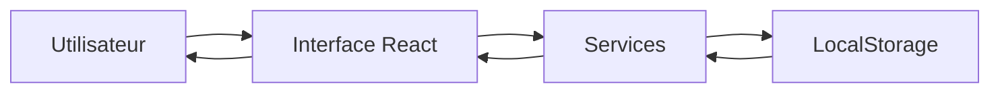

# 🚌 VoyageBj - Plateforme de Réservation de Transport Interurbain

<div align="center">


[](https://reactjs.org/)
[](https://www.typescriptlang.org/)
[](https://vitejs.dev/)
[](https://tailwindcss.com/)

**Digitalisez le transport terrestre au Bénin 🇧🇯**

[Démo](#) • [Documentation](#fonctionnalités) • [Installation](#installation)

</div>

---

## 📖 Table des Matières

- [À Propos](#-à-propos)
- [Fonctionnalités](#-fonctionnalités)
- [Stack Technologique](#-stack-technologique)
- [Architecture](#-architecture)
- [Installation](#-installation)
- [Utilisation](#-utilisation)
- [Structure du Projet](#-structure-du-projet)
- [Contribution](#-contribution)
- [Licence](#-licence)

---

## 🎯 À Propos

**VoyageBj** est une plateforme web moderne de réservation de billets de transport interurbain au Bénin. Elle connecte les voyageurs aux compagnies de transport agréées, offrant une expérience de réservation fluide, sécurisée et entièrement digitalisée.

### 🌟 Vision

Transformer le secteur du transport terrestre béninois en digitalisant les processus de réservation, en améliorant la transparence et en optimisant l'expérience utilisateur pour les voyageurs et les compagnies.

### 🎯 Objectifs

- ✅ Faciliter la réservation de billets en ligne 24h/24
- ✅ Offrir une plateforme de gestion complète pour les compagnies
- ✅ Garantir la sécurité des transactions et des données
- ✅ Améliorer la visibilité des compagnies de transport
- ✅ Réduire les files d'attente dans les gares routières

---

## ✨ Fonctionnalités

### 👤 Pour les Voyageurs

- 🔍 **Recherche Intelligente** : Trouvez des trajets par ville de départ/arrivée et date
- 🎫 **Réservation en Ligne** : Réservez et payez vos billets instantanément
- 📱 **E-Billets avec QR Code** : Téléchargez vos billets en PDF/PNG avec QR code sécurisé
- 💎 **Classes de Voyage** : Choisissez entre Standard et Premium
- 📊 **Tableau de Bord Personnel** : Suivez vos réservations et gérez votre profil
- 🔔 **Notifications en Temps Réel** : Recevez des confirmations et alertes
- 📅 **Validation des Jours** : Vérification automatique des jours de départ disponibles

### 🏢 Pour les Compagnies

- 📈 **Dashboard Analytique** : Statistiques de réservations et revenus en temps réel
- 🚏 **Gestion des Stations** : Créez et gérez vos sous-stations et routes directes
- 💰 **Tarification Flexible** : Définissez des prix Standard et Premium personnalisés
- 📋 **Liste des Réservations** : Visualisez et exportez vos réservations (CSV/PDF)
- 🖼️ **Profil Personnalisable** : Logo, bannière et informations de l'agence
- 🤖 **Génération de Descriptions IA** : Descriptions automatiques pour vos trajets
- 📸 **Upload d'Images** : Compression automatique jusqu'à 5MB

### 👨‍💼 Pour les Administrateurs

- ✅ **Validation des Compagnies** : Vérification des documents ANaTT
- 👁️ **Visualisation de Documents** : Lecteur PDF intégré pour les documents
- 📊 **Vue d'Ensemble** : Statistiques globales de la plateforme
- 🔐 **Gestion des Utilisateurs** : Approbation/rejet des inscriptions

---

## 🛠️ Stack Technologique

### Frontend

<div align="center">

| Technologie | Version | Utilisation |
|------------|---------|-------------|
|  | 19.0.0 | Framework UI principal |
|  | 5.7.2 | Typage statique |
|  | 6.1.0 | Build tool & dev server |
|  | 4.0.0 | Styling & design system |
|  | 0.475.0 | Icônes |

</div>

### Bibliothèques Clés

- **react-qr-code** (2.0.18) : Génération de QR codes pour les billets
- **html-to-image** (1.11.13) : Export de billets en PNG
- **jspdf** (3.0.4) : Génération de PDF pour les billets
- **recharts** (2.15.0) : Graphiques et visualisations de données

### Outils de Développement

- **ESLint** : Linting et qualité du code
- **TypeScript Compiler** : Compilation et vérification de types
- **Vite Plugin React** : Support React avec Fast Refresh

---

## 🏗️ Architecture

### Structure de l'Application

```
VoyageBj/
├── 🎨 Frontend (React + TypeScript)
│   ├── Components (Réutilisables)
│   ├── Pages (Vues principales)
│   ├── Services (Logique métier)
│   └── Utils (Fonctions utilitaires)
│
├── 💾 Stockage (LocalStorage)
│   ├── Users (Voyageurs, Compagnies, Admins)
│   ├── Stations (Routes et sous-stations)
│   └── Reservations (Billets)
│
└── 🎨 Design System
    ├── Couleurs du Bénin (Vert, Jaune, Rouge)
    ├── Typographie (Dancing Script, Inter)
    └── Composants UI personnalisés
```

### Flux de Données



### Rôles Utilisateurs

1. **VOYAGEUR** : Recherche et réserve des trajets
2. **COMPANY** : Gère les stations et visualise les réservations
3. **ADMIN** : Valide les compagnies et supervise la plateforme

---

## 🚀 Installation

### Prérequis

- **Node.js** >= 18.0.0
- **npm** >= 9.0.0 ou **yarn** >= 1.22.0

### Étapes d'Installation

1. **Cloner le dépôt**
```bash
git clone https://github.com/votre-username/voyagebj.git
cd voyagebj
```

2. **Installer les dépendances**
```bash
npm install
# ou
yarn install
```

3. **Lancer le serveur de développement**
```bash
npm run dev
# ou
yarn dev
```

4. **Ouvrir dans le navigateur**
```
http://localhost:5173
```

### Build de Production

```bash
npm run build
# ou
yarn build
```

Les fichiers optimisés seront générés dans le dossier `dist/`.

### Prévisualisation du Build

```bash
npm run preview
# ou
yarn preview
```

---

## 📘 Utilisation

### Compte Admin par Défaut

```
Email: admin@voyagebj.com
Mot de passe: admin123
```

### Inscription Voyageur

1. Cliquez sur "Je voyage" sur la page d'accueil
2. Remplissez le formulaire d'inscription
3. Connectez-vous avec vos identifiants

### Inscription Compagnie

1. Cliquez sur "Je suis une Compagnie"
2. Remplissez les informations de l'agence
3. Uploadez les documents ANaTT (max 5MB, compression automatique)
4. Attendez la validation par un administrateur

### Réserver un Trajet

1. Connectez-vous en tant que voyageur
2. Utilisez le widget de recherche (Départ, Arrivée, Date)
3. Sélectionnez une compagnie et un trajet
4. Choisissez votre classe (Standard/Premium)
5. Remplissez vos informations et validez
6. Téléchargez votre e-billet avec QR code

### Créer une Station (Compagnie)

1. Connectez-vous en tant que compagnie
2. Accédez à "Gérer Stations"
3. Cliquez sur "Nouvelle Station"
4. Remplissez les informations :
   - Type (Station/Route directe)
   - Points A et B
   - Jours de travail
   - Heures de départ/arrivée
   - Prix Standard et Premium
5. Générez une description automatique (optionnel)
6. Sauvegardez

---

## 📂 Structure du Projet

```
voyagebj/
│
├── 📁 public/                  # Fichiers statiques
│   └── vite.svg
│
├── 📁 src/
│   ├── 📁 components/          # Composants React réutilisables
│   │   ├── Footer.tsx
│   │   ├── Hero.tsx
│   │   ├── Navbar.tsx
│   │   ├── NotificationSystem.tsx
│   │   ├── SplashScreen.tsx
│   │   └── Ticket.tsx
│   │
│   ├── 📁 pages/               # Pages principales
│   │   ├── 📁 auth/            # Authentification
│   │   │   ├── LoginAdmin.tsx
│   │   │   ├── LoginCompany.tsx
│   │   │   ├── LoginVoyageur.tsx
│   │   │   ├── SignupCompany.tsx
│   │   │   └── SignupVoyageur.tsx
│   │   │
│   │   ├── 📁 dashboards/      # Tableaux de bord
│   │   │   ├── AdminDashboard.tsx
│   │   │   ├── ClientDashboard.tsx
│   │   │   └── CompanyDashboard.tsx
│   │   │
│   │   ├── 📁 company/         # Gestion compagnie
│   │   │   └── StationManager.tsx
│   │   │
│   │   ├── CompaniesPage.tsx   # Liste publique des compagnies
│   │   ├── LandingPage.tsx     # Page d'accueil
│   │   └── SearchResultsPage.tsx
│   │
│   ├── 📁 services/            # Logique métier
│   │   ├── description.tsx     # Génération de descriptions
│   │   └── storage.ts          # Gestion LocalStorage
│   │
│   ├── 📁 utils/               # Utilitaires
│   │   └── imageUtils.ts       # Compression d'images
│   │
│   ├── App.tsx                 # Composant racine
│   ├── index.css               # Styles globaux
│   ├── main.tsx                # Point d'entrée
│   └── types.ts                # Définitions TypeScript
│
├── 📄 index.html               # Template HTML
├── 📄 package.json             # Dépendances
├── 📄 tailwind.config.ts       # Configuration Tailwind
├── 📄 tsconfig.json            # Configuration TypeScript
├── 📄 vite.config.ts           # Configuration Vite
└── 📄 README.md                # Ce fichier
```

---

## 🎨 Design System

### Palette de Couleurs (Bénin)

```css
--benin-green: #008751   /* Vert */
--benin-yellow: #FCD116  /* Jaune */
--benin-red: #E8112D     /* Rouge */
```

### Typographie

- **Titres** : Dancing Script (cursive, élégante)
- **Corps** : Inter (sans-serif, moderne)

### Composants Clés

- **Benin Gradient** : Dégradé vert → jaune → rouge
- **Glassmorphism** : Effets de verre pour les modales
- **Animations** : Transitions fluides et micro-interactions

---

## 🔧 Fonctionnement Technique

### Gestion de l'État

L'application utilise **React Hooks** (`useState`, `useEffect`) pour la gestion d'état locale. Les données sont persistées dans **LocalStorage** via le service `storage.ts`.

### Stockage des Données

```typescript
// Structure LocalStorage
{
  "voyagebj_users": User[],
  "voyagebj_stations": Station[],
  "voyagebj_reservations": Reservation[]
}
```

### Compression d'Images

Les images uploadées sont automatiquement compressées :
- **Limite** : 5MB
- **Cible** : 700KB
- **Format** : Base64 (stockage dans LocalStorage)

### Génération de Billets

1. **Composant Ticket** : Rendu HTML/CSS du billet
2. **html-to-image** : Conversion en image PNG
3. **jspdf** : Génération du PDF
4. **QR Code** : Encodage des données du voyage

### Validation des Jours

Lors de la réservation, le système vérifie que la date sélectionnée correspond à un jour de travail de la compagnie :

```typescript
const dayIndex = new Date(date).getDay();
const selectedDay = jsDayToMockDayMap[dayIndex]; // "Lun", "Mar", etc.
if (!station.workDays.includes(selectedDay)) {
  // Alerte utilisateur
}
```

---

## 🤝 Contribution

Les contributions sont les bienvenues ! Voici comment participer :

1. **Fork** le projet
2. Créez une **branche** pour votre fonctionnalité (`git checkout -b feature/AmazingFeature`)
3. **Committez** vos changements (`git commit -m 'Add AmazingFeature'`)
4. **Push** vers la branche (`git push origin feature/AmazingFeature`)
5. Ouvrez une **Pull Request**

### Guidelines

- Suivez les conventions de code TypeScript
- Ajoutez des commentaires en **français**
- Testez vos modifications avant de soumettre
- Mettez à jour la documentation si nécessaire

---

## 📄 Licence

Ce projet est sous licence **MIT**. Voir le fichier `LICENSE` pour plus de détails.

---

## 👨‍💻 Auteur

**Elton Hounnou**

- GitHub: [@elton-hounnou](https://github.com/elton-hounnou)
- Email: contact@voyagebj.com

---

## 🙏 Remerciements

- **React Team** pour l'excellent framework
- **Tailwind Labs** pour TailwindCSS
- **Lucide Icons** pour les icônes magnifiques
- **Communauté Open Source** pour les bibliothèques utilisées

---

<div align="center">

**Fait avec ❤️ au Bénin 🇧🇯**

[⬆ Retour en haut](#-voyagebj---plateforme-de-réservation-de-transport-interurbain)

</div>